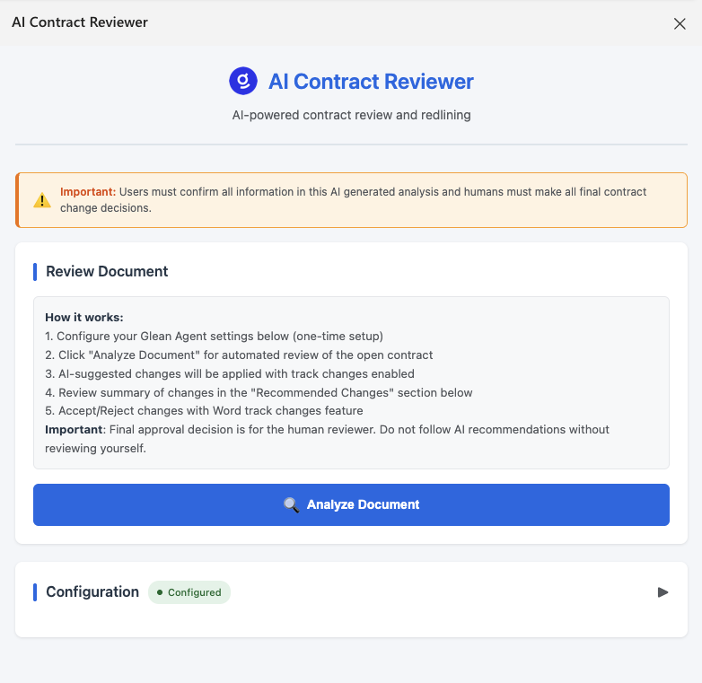
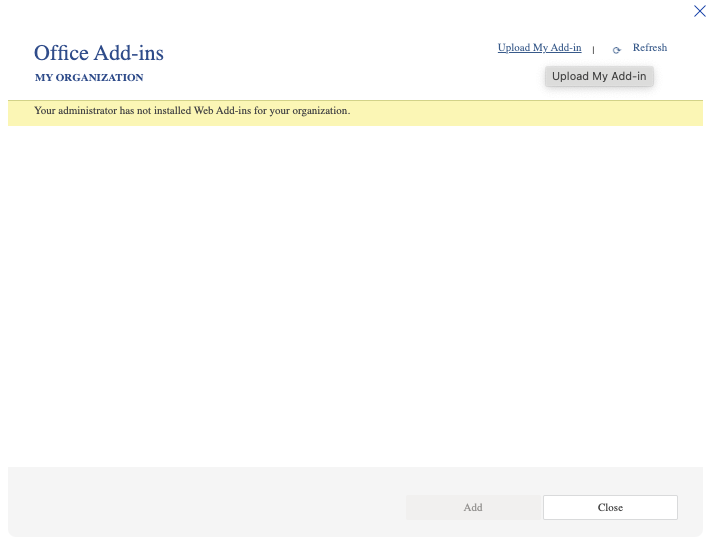
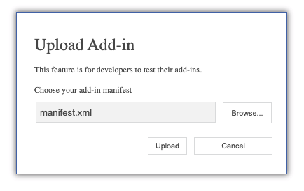
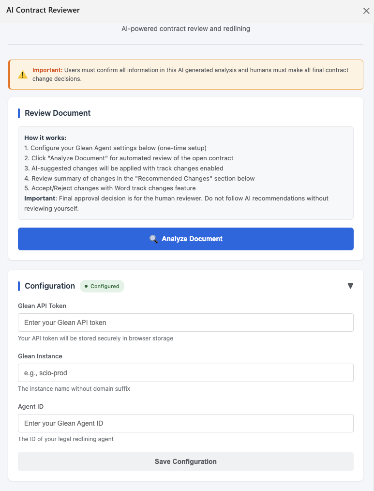

# AI Contract Reviewer - Microsoft Word Add-in

> **⚠️ Demo Project:** This is a demonstration project. Review security, authentication, testing, and compliance before deploying to production.

> Automated legal document redlining powered by Glean AI

[](https://opensource.org/licenses/MIT)
[](CONTRIBUTING.md)

## 🎯 Overview

AI Contract Reviewer is a Microsoft Word Add-in that leverages Glean's AI capabilities to automatically analyze legal contracts and suggest improvements through tracked changes. Perfect for legal teams looking to streamline contract review processes.

### ✨ Features

- **Automated Analysis**: AI-powered contract review using Glean agents
- **Tracked Changes**: All suggestions applied as Word tracked changes
- **Multiple Change Types**: Replace, insert, delete, and add new clauses
- **Secure Deployment**: Production-ready AWS infrastructure with WAF
- **Easy Configuration**: Simple setup with environment variables



## 🏗️ Architecture


**Components:**
- **Word Add-in**: Client-side JavaScript application running in Word
- **AWS Lambda**: Proxy for Glean API calls (handles CORS and authentication)
- **CloudFront + S3**: Global CDN for static assets with caching
- **WAF**: Web Application Firewall for security and rate limiting
- **Glean AI**: Contract analysis engine with customizable agents

[Detailed Architecture Documentation](docs/architecture.md)

## 🚀 Quick Start

### Prerequisites

- Node.js 18+ and npm
- AWS CLI configured with appropriate credentials
- Microsoft Word (Desktop or Online)
- Glean account with API access

### Installation

1. **Clone the repository**
   ```bash
   git clone https://github.com/eugene-wiehahn-glean/aiContractReviewerAddInForO365Word.git
   cd aiContractReviewerAddInForO365Word
   ```

2. **Run setup script**
   ```bash
   ./setup.sh
   ```
   
   The setup script will:
   - Check prerequisites
   - **Interactively prompt for your credentials** (API token, instance, agent ID, etc.)
   - **Automatically create `.env` file** with your configuration
   - Install dependencies
   - Deploy to AWS (or skip for manual deployment)
   
   You'll be asked to provide:
   - **GLEAN_API_TOKEN**: Get from [Glean Admin Console](https://app.glean.com/admin/platform/tokenManagement)
   - **GLEAN_INSTANCE**: Your Glean instance name (e.g., `your-company`)
   - **GLEAN_AGENT_ID**: Your contract review agent ID
   - **AWS_PROFILE**: Your AWS CLI profile name
   - **CUSTOM_DOMAIN**: Your custom domain (e.g., `addin.yourcompany.com`)

3. **Upload to Word**
   
   Navigate to: Insert → Get Add-ins → My Add-ins → Upload My Add-in
   
   
   
   Select `word-addin/manifest.xml` and upload:
   
   

4. **Configure the Add-in**
   
   After uploading, click the **AI Contract Reviewer** button in the Word ribbon to open the task pane.
   
   Expand the **Configuration** section and enter the same credentials you provided to `setup.sh`:
   
   
   
   - **Glean API Token**: Your Glean API token
   - **Glean Instance**: Your instance name (e.g., `your-company`)
   - **Agent ID**: Your contract review agent ID
   
   Click **Save Configuration**. The status should change to "Configured" (green).

5. **Start Analyzing Contracts!**
   
   1. Open a contract document in Word
   2. Click **Analyze Document** in the task pane
   3. Wait 1-2 minutes for AI analysis
   4. Review the tracked changes applied to your document

## 📖 Documentation

- [Architecture Overview](docs/architecture.md)
- [Deployment Guide](docs/deployment.md)
- [Word Add-in README](word-addin/README.md)
- [CloudFormation README](cloudformation/README.md)
- [Contributing Guidelines](CONTRIBUTING.md)
- [Code of Conduct](CODE_OF_CONDUCT.md)
- [Security Policy](SECURITY.md)

## 🧪 Testing

Test the Glean API integration:
```bash
# Set environment variables first
export GLEAN_API_TOKEN=your_token
export GLEAN_INSTANCE=your_instance
export GLEAN_AGENT_ID=your_agent_id

# Run test
npx tsx test-api.ts
```

## 🛠️ Development

### Deployment
```bash
cd cloudformation
./deploy.sh
```

This deploys the add-in to AWS with:
- S3 + CloudFront for hosting
- Lambda proxy for Glean API calls
- WAF for security

### Updating After Changes
```bash
# After modifying add-in code
cd cloudformation
./deploy.sh  # Uploads new files and invalidates cache
```

## 📝 Configuration

### Glean Agent Setup

Your Glean agent should:
1. Accept two inputs:
   - `Customer Contract Text (Provided by Word Add-In)`: Full contract text
   - `Link to our standard MSA`: URL to your standard contract

2. Return JSON in this format:
   ```json
   {
     "changes": [
       {
         "id": "change_1",
         "type": "replace",
         "searchText": "exact text to find",
         "replaceWith": "new text",
         "reason": "Explanation",
         "category": "legal_protection"
       }
     ],
     "summary": "Overview of changes"
   }
   ```

3. Support four change types:
   - `replace`: Find and replace text
   - `insert`: Add text after anchor
   - `delete`: Remove specific text
   - `insertClause`: Add new sections

### Environment Variables

See `.env.example` for all available configuration options.

## 🤝 Contributing

We welcome contributions! Please see our [Contributing Guidelines](CONTRIBUTING.md) for details.

### Development Workflow

1. Fork the repository
2. Create a feature branch
3. Make your changes
4. Test locally
5. Submit a pull request

## 📄 License

This project is licensed under the MIT License - see the [LICENSE](LICENSE) file for details.

## 🆘 Support

- [Open an issue](https://github.com/eugene-wiehahn-glean/aiContractReviewerAddInForO365Word/issues)

## 🙏 Acknowledgments

Built with 💙 by the team at [Glean](https://glean.com)

---

**Note**: This is an open-source project maintained by Glean. We're also [hiring](https://www.glean.com/careers)!
