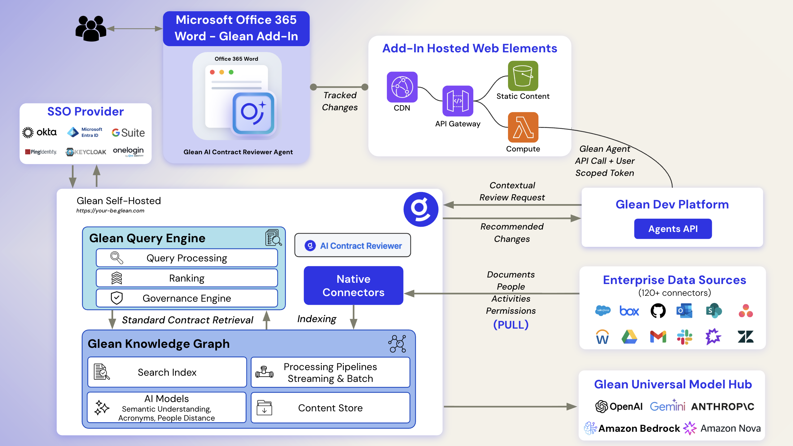

# Architecture Documentation

## Overview

The AI Contract Reviewer is built as a Microsoft Word Add-in with a serverless AWS backend. This architecture provides scalability, security, and global availability.

## Architecture Diagram



### Text Representation

```
┌─────────────────────────────────────────────────────────────────┐
│                         Microsoft Word                           │
│  ┌──────────────────────────────────────────────────────────┐  │
│  │              Word Add-in (JavaScript)                     │  │
│  │  - Configuration UI                                       │  │
│  │  - Document text extraction                               │  │
│  │  - Tracked changes application                            │  │
│  └──────────────────────────────────────────────────────────┘  │
└─────────────────────────────────────────────────────────────────┘
                              │
                              │ HTTPS
                              ▼
┌─────────────────────────────────────────────────────────────────┐
│                         AWS Infrastructure                       │
│                                                                  │
│  ┌────────────────┐         ┌──────────────────┐               │
│  │   CloudFront   │────────▶│   S3 Bucket      │               │
│  │   (CDN + WAF)  │         │  (Static Files)  │               │
│  └────────────────┘         └──────────────────┘               │
│         │                                                        │
│         │ API Requests                                          │
│         ▼                                                        │
│  ┌────────────────┐         ┌──────────────────┐               │
│  │  API Gateway   │────────▶│  Lambda Proxy    │               │
│  │                │         │  (CORS Handler)  │               │
│  └────────────────┘         └──────────────────┘               │
└─────────────────────────────────────────────────────────────────┘
                              │
                              │ HTTPS
                              ▼
                    ┌──────────────────┐
                    │   Glean API      │
                    │   (AI Agent)     │
                    └──────────────────┘
```

## Components

### 1. Word Add-in (Frontend)

**Technology**: Vanilla JavaScript + Office.js API

**Responsibilities**:
- User interface for configuration
- Extract document text from Word
- Call Lambda proxy API
- Parse AI response
- Apply tracked changes to document

**Key Files**:
- `word-addin/taskpane.html`: UI layout
- `word-addin/src/taskpane.js`: Business logic
- `word-addin/manifest.xml`: Add-in configuration

**Security**:
- API tokens stored in browser localStorage
- HTTPS-only communication
- CORS-compliant requests

### 2. AWS Lambda Proxy

**Technology**: Python 3.12 + urllib3

**Responsibilities**:
- Handle CORS preflight requests
- Proxy requests to Glean API
- Add authentication headers
- Return formatted responses

**Key Features**:
- 5-minute timeout for long-running AI analysis
- Error handling and logging
- Request/response transformation

**Security**:
- Minimal IAM permissions
- CloudWatch logging
- No persistent storage

### 3. API Gateway

**Technology**: AWS API Gateway (REST API)

**Responsibilities**:
- HTTP endpoint for Lambda
- Request throttling
- API key management (optional)

**Configuration**:
- CORS enabled
- 30-second timeout
- Regional endpoint

### 4. CloudFront + S3

**Technology**: AWS CloudFront + S3

**Responsibilities**:
- Serve static files (HTML, JS, CSS, assets)
- Global CDN for low latency
- HTTPS termination
- Caching

**Security**:
- Origin Access Control (OAC)
- S3 bucket not publicly accessible
- Security headers (HSTS, CSP, etc.)
- TLS 1.2+ only

### 5. AWS WAF

**Technology**: AWS Web Application Firewall

**Responsibilities**:
- Protect against common attacks
- Rate limiting (2000 req/5min per IP)
- SQL injection prevention
- XSS protection

**Rules**:
- AWS Core Rule Set
- AWS Known Bad Inputs
- Custom rate limiting

### 6. Glean AI

**Technology**: Glean Agent API

**Responsibilities**:
- Analyze contract text
- Compare against standard MSA
- Generate change recommendations
- Return structured JSON

**Input**:
- Customer contract text
- Link to standard MSA

**Output**:
- List of changes (replace, insert, delete, insertClause)
- Reasons for each change
- Summary

## Data Flow

### Document Analysis Flow

1. **User Action**: User clicks "Analyze Document" in Word
2. **Text Extraction**: Add-in extracts full document text using Office.js
3. **API Request**: Add-in sends POST to Lambda proxy via API Gateway
4. **Proxy Processing**: Lambda adds auth headers and forwards to Glean
5. **AI Analysis**: Glean agent analyzes contract (1-2 minutes)
6. **Response**: Glean returns JSON with changes
7. **Proxy Return**: Lambda forwards response to add-in
8. **Change Application**: Add-in applies each change as tracked change
9. **Results Display**: Add-in shows success/failure for each change

### Configuration Flow

1. **User Input**: User enters API token, instance, agent ID
2. **Storage**: Add-in stores in browser localStorage
3. **Validation**: Add-in checks configuration before API calls
4. **Usage**: Configuration sent with each API request

## Deployment Architecture

### Local Development

```
Developer Machine
├── word-addin (localhost:3000)
│   ├── Self-signed certificate
│   └── webpack-dev-server
└── Word Desktop
    └── Sideloaded manifest
```

### Production

```
AWS us-east-1
├── CloudFormation Stack
│   ├── S3 Bucket (static files)
│   ├── CloudFront Distribution
│   ├── WAF WebACL
│   ├── Lambda Function
│   └── API Gateway
└── Route53 (DNS)
    └── CNAME → CloudFront
```

## Security Architecture

### Defense in Depth

1. **Network Layer**:
   - WAF rules
   - Rate limiting
   - DDoS protection (CloudFront)

2. **Application Layer**:
   - Input validation
   - CORS restrictions
   - HTTPS-only

3. **Data Layer**:
   - No persistent storage
   - Encrypted in transit (TLS)
   - CloudWatch logs encrypted

### Authentication Flow

```
User → Word Add-in → API Gateway → Lambda → Glean API
         (Token)      (CORS)      (Proxy)   (Bearer Auth)
```

## Scalability

### Horizontal Scaling

- **CloudFront**: Automatic global distribution
- **Lambda**: Auto-scales to 1000 concurrent executions
- **API Gateway**: Handles 10,000 req/sec by default
- **S3**: Unlimited storage and bandwidth

### Performance Optimization

- **CloudFront Caching**: 5-minute cache for static files
- **Lambda Warm-up**: First request may be slower (cold start)
- **Glean API**: 1-2 minute analysis time (not cacheable)

## Monitoring & Observability

### CloudWatch Metrics

- Lambda invocations, errors, duration
- API Gateway requests, latency, errors
- CloudFront requests, cache hit ratio
- WAF blocked requests

### CloudWatch Logs

- Lambda execution logs
- API Gateway access logs
- Glean API responses (first 500 chars)

### Alarms (Recommended)

- Lambda error rate > 5%
- API Gateway 5xx errors > 10
- WAF block rate > 50%
- Lambda duration > 4 minutes

## Cost Optimization

### Monthly Costs (Estimated)

- **S3**: $0.023/GB storage + $0.09/GB transfer
- **CloudFront**: $0.085/GB (first 10TB)
- **Lambda**: $0.20/million requests + $0.0000166667/GB-second
- **API Gateway**: $3.50/million requests
- **WAF**: $5/month + $1/rule + $0.60/million requests

**Total**: ~$10-20/month for moderate usage (100 analyses/day)

### Cost Reduction Tips

1. Enable CloudFront caching for static files
2. Use Lambda reserved concurrency to control costs
3. Set CloudWatch log retention to 7 days
4. Monitor and optimize Lambda memory allocation

## Disaster Recovery

### Backup Strategy

- **Code**: Version controlled in GitHub
- **Configuration**: Infrastructure as Code (CloudFormation)
- **Data**: No persistent data to backup

### Recovery Time Objective (RTO)

- **CloudFormation**: ~10 minutes to redeploy
- **DNS**: ~5 minutes to propagate
- **Total**: ~15 minutes

### Recovery Point Objective (RPO)

- No data loss (stateless architecture)

## Future Enhancements

### Potential Improvements

1. **Authentication**: OAuth 2.0 instead of API tokens
2. **Caching**: Cache Glean responses for identical contracts
3. **Batch Processing**: Analyze multiple contracts
4. **Analytics**: Track usage patterns and success rates
5. **Multi-region**: Deploy to multiple AWS regions
6. **CDN**: Use CloudFront for API Gateway as well
7. **Monitoring**: Add application performance monitoring (APM)

## References

- [Office Add-ins Documentation](https://learn.microsoft.com/en-us/office/dev/add-ins/)
- [Glean API Documentation](https://developers.glean.com/)
- [AWS Lambda Best Practices](https://docs.aws.amazon.com/lambda/latest/dg/best-practices.html)
- [CloudFront Security](https://docs.aws.amazon.com/AmazonCloudFront/latest/DeveloperGuide/security.html)
